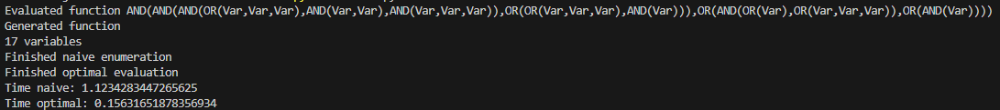

# FBFE - Fast Boolean Function Enumerator

A novel implementation of a Boolean function enumerator, that is faster than any known alternative. The algorithm works best for 'bushier' trees, meaning trees that resemble k-nary trees the most. Here, by k-nary trees I mean trees where $k$ is the maximum amount of children of any gate in the function tree. At best the complexity of the algorithm is $O(log_k(m) \cdot 2^n)$ and at worst it is $O(m \cdot 2^n)$, where $n$ is the number of variables in the function and $m$ is the number of gates and k is the maximum number of children in a node. Normal enumerators have a complexity of $O(m \cdot 2^n)$.

# The algorithm
The main idea of the algorithm is to leverage the fact that we are enumerating a function, and the fact that usually the function tree changes very little if we do the evaluation in a certain order. In the implementation I use the Gray code for determining the order of the enumeration. The Gray code is a sequence of binary numbers of length $n$ where each number differs in exactly one digit from the previous one. This property is important for the algorithm, as it allows it not to recalculate big chunks of the tree with every different input.

We start iterating through the algorithm. For the first code which is always when all variables are 0, we do nothing. In the second iteration, when a single bit is changed, we flip it in the equation tree and we start a procedure called upward propagation. The upward propagation essentially uses the chain of parents of each node to update the entire equation, rather than updating the entire equation.

During upward propagation, if the current bit is $1$, we add 1 to a counter in the parent called $trueChildren$, which represents the number of children nodes with value $1$. Similarly, we subtract $1$ if the node is 0. From this we can compute the value of the gate: if $trueChildren$ equals the number of children for an $AND$ gate it is true and if it is greater than 0 for an $OR$ gate, then it is true. We check if the value of the parent changes as a result of the changes in the counter. If it does, we continue the same process on the parent, otherwise we stop. I will refer to this kind of early stop as **propagation halting**. The value of the root node of the equation, will be the result.

The algorithm can easily work with $OR$, $AND$, and $VOT$ gates. Implementing unary operators like $NOT$ should also be rather trivial.

# Complexity

A more thorough complexity analysis is required, but it seems that at best the complexity of the algorithm is $O(log_k(m) \cdot 2^n)$ and at worst it is $O(m \cdot 2^n)$ . The complexity approaches $O(log(m) \cdot 2^n)$ for trees that are more 'complete'. It appears that the complexity is proportional to the metric: $\frac{|G|}{|V|}$, where $|G|$ is the gate count and $|V|$ is the vertex count. We will call this metric the **dispersion** of the function tree. It would probably be useful to do some analysis on different instances of this metrics, to see if the relationship is linear or if it is better.  It is worth noting that the meaning of $\frac{|G|}{|V|}$ would likely change depending on $k$ in k-nary trees. It would probably be good to find a way to incorporate $k$ into the formula in order to normalize the metric.

The intuition behind this metric is that the more gates there are in the tree relative to the number of events, the more you can avoid recomputing similar paths in the tree (assuming we are not allowing gates which only have a single child).

For example, consider the case of an equation with a single gate and a very large number of children. In this case the dispersion would be approaching $0$, when the number of children becomes very big. In the optimized version and the original version of the function enumeration one gate will have to be evaluated.

If we consider the case where we only use two values for the function and have a gate per depth level, the complexity of the function would be $O((m/2) \cdot 2^n)$. If we generalize the formula, for any Boolean function, then we have $O(avg_d \cdot 2^n)$, where $avg_d$ is the sum of all the depth of all variables divided by the number of all variables.

Additionally, I suspect that propagation halting will be very useful especially in k-nary trees with higher k value. For an $OR$ gate to change its value, either one bit has to become $1$ when all the children are $0$, or one has to become $0$, only when a single child has value $1$. This means that if we have $c$ children, we have $2^c$ value combinations of the children, but only $c + 1$ states that when reached from another particular state, would result in a change of the gate value. The idea works in a similar way for $AND$ gates.

Overall, the complexity analysis would be non-trivial, but it would be useful to at least determine the average, best-case and worst-case complexity of the algorithm in different scenarios.

# Use cases

## Digital circuit design
The algorithm could be used to quickly enumerate the values of digital circuits. This would be particularly useful in the testing stage, to find errors, mismatched values or even provide insight into how to optimize it further.

## Fault tree analysis
In this case, the algorithm can be used to compute all the input/output pairs of a fault tree to identify which events lead to the occurrence of the Top Event. It would be particularly useful when there are many fault trees to be evaluated. Perhaps this thought needs more refinement, but it would also be possible to identify critical components in this fault tree using this approach. If changing a variable leads to a change in the Top Event, it means it is part of a Minimal Cut Set. This information might be used somehow for faster Minimal Cut Set computation.

## Cryptographic function evaluation

The algorithm could be useful in the design of cryptographic hash functions, to ensure that the functions/encryption methods are secure. Adding other gates to the algorithm such as $XOR$ would be trivial.
# Other features

## Parallelization

The algorithm in itself is very easy to parallelize. To do that, one would have to precompute the gray codes and split the code list into $n$ parts. Each parallel process would have to fully evaluate the first configuration in the list, and then continue applying the improved algorithm. In this case it would be important to be careful not too use too many cores,  for smaller problems. If we were to use $2^n$ threads, there would be no difference between parallelizing the non-optimized algorithm and FBFE.

## One-variable switch

Given that only one variable's value is switched during the computation process, you only have to remember a list of indices instead of a list of tuples in order to enumerate the function. This can be efficient in terms of memory, but also saves time, since you do not have to update the value of each variable individually. Computing the Gray codes can be done using Boolean operations, so the operation is as fast as it gets.

## Easy to implement
The algorithm is rather straightforward to implement. It uses minimal memory, and can be easily integrated in existing systems.

# Initial test results

It appears that in most cases the algorithm is 10 times faster than the naive implementation. For understnading why this is the case a more thorough analysis should be made, keeping in mind what was mentioned in the previous paragraphs.

